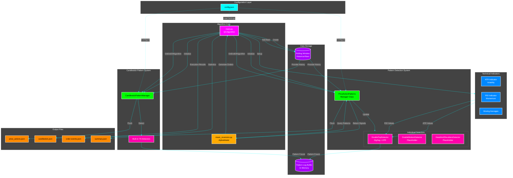

# algo-main System Flow

This document describes how the pattern detection system works in the QuantConnect algorithm.

## Main System Architecture

```mermaid
%%{init: {'theme':'dark', 'themeVariables': { 'primaryColor':'#00ff00','primaryTextColor':'#fff','primaryBorderColor':'#00ff00','lineColor':'#00ffff','secondaryColor':'#ff00ff','tertiaryColor':'#ffff00','background':'#000000','mainBkg':'#1a1a1a','secondBkg':'#2d2d2d'}}}%%
flowchart TB
    Start([Algorithm Starts]):::startEnd --> LoadConfig[Load config.json<br/>Read settings]:::config
    LoadConfig --> CheckPattern{Pattern Detection<br/>Enabled?}:::decision
    
    CheckPattern -->|No| SimpleMode[Run Strategy<br/>Without Patterns]:::process
    CheckPattern -->|Yes| InitPattern[Initialize Pattern<br/>Detection System]:::process
    
    InitPattern --> CreateManagers[Create Managers:<br/>- CandlestickPatternManager<br/>- PriceActionPatterns]:::init
    CreateManagers --> CreateWindow[Create RollingWindow<br/>for Historical Bars]:::init
    CreateWindow --> SetupIndicators[Setup Indicators:<br/>- ATR<br/>- RSI<br/>- Moving Averages]:::init
    
    SetupIndicators --> WarmUp[Warm-Up Phase:<br/>Wait for indicators<br/>to be ready]:::warmup
    WarmUp --> ReadyCheck{All Indicators<br/>Ready?}:::decision
    
    ReadyCheck -->|No| WaitMore[Wait for more data]:::wait
    WaitMore --> ReadyCheck
    ReadyCheck -->|Yes| StartTrading[Begin Trading Loop]:::process
    
    StartTrading --> OnData[OnData Event:<br/>New Bar Received]:::event
    
    OnData --> AddToWindow[Add Bar to<br/>RollingWindow]:::process
    AddToWindow --> UpdateIndicators[Update All Indicators<br/>with New Bar]:::process
    UpdateIndicators --> CheckReady{Window<br/>Ready?}:::decision
    
    CheckReady -->|No| OnData
    CheckReady -->|Yes| DetectPatterns[Detect Patterns]:::process
    
    DetectPatterns --> OnData
    
    SimpleMode --> End([Algorithm Ends]):::startEnd
    
    classDef startEnd fill:#ff00ff,stroke:#fff,stroke-width:3px,color:#fff
    classDef config fill:#00ffff,stroke:#fff,stroke-width:2px,color:#000
    classDef decision fill:#ffff00,stroke:#fff,stroke-width:2px,color:#000
    classDef process fill:#00ff00,stroke:#fff,stroke-width:2px,color:#000
    classDef init fill:#ff8800,stroke:#fff,stroke-width:2px,color:#000
    classDef warmup fill:#ff00aa,stroke:#fff,stroke-width:2px,color:#fff
    classDef wait fill:#aa00ff,stroke:#fff,stroke-width:2px,color:#fff
    classDef event fill:#00aaff,stroke:#fff,stroke-width:2px,color:#fff
```



## Pattern Detection Detail Flow

```mermaid
%%{init: {'theme':'dark', 'themeVariables': { 'primaryColor':'#00ff00','primaryTextColor':'#fff','primaryBorderColor':'#00ff00','lineColor':'#00ffff','secondaryColor':'#ff00ff','tertiaryColor':'#ffff00','background':'#000000','mainBkg':'#1a1a1a','secondBkg':'#2d2d2d'}}}%%
flowchart TB
    Start([New Bar Arrives]):::event --> AddBar[Add Bar to<br/>Pattern History]:::process
    
    AddBar --> UpdateDetector[Update Pattern Detector:<br/>Pass bar to detector]:::process
    
    UpdateDetector --> GetATR[Get Current ATR Value<br/>for volatility measurement]:::process
    GetATR --> GetRSI[Get Current RSI Value<br/>for divergence detection]:::process
    
    GetRSI --> ZigZag[ZigZag Pivot Detection:<br/>Track price swings]:::algo
    
    ZigZag --> CheckTrend{Current<br/>Trend?}:::decision
    
    CheckTrend -->|UP| TrackHigh[Track Highest High<br/>Store volume & RSI]:::track
    CheckTrend -->|DOWN| TrackLow[Track Lowest Low]:::track
    
    TrackHigh --> CheckReversal{Price drops by<br/>ATR × 2?}:::decision
    TrackLow --> CheckReversal2{Price rises by<br/>ATR × 2?}:::decision
    
    CheckReversal -->|Yes| RecordPeak[Record PEAK Pivot:<br/>- Price<br/>- Time<br/>- Volume<br/>- RSI]:::record
    CheckReversal -->|No| Continue1[Continue tracking]:::wait
    
    CheckReversal2 -->|Yes| RecordTrough[Record TROUGH Pivot:<br/>- Price<br/>- Time]:::record
    CheckReversal2 -->|No| Continue2[Continue tracking]:::wait
    
    RecordPeak --> SwitchToDown[Switch trend to DOWN]:::switch
    RecordTrough --> SwitchToUp[Switch trend to UP]:::switch
    
    SwitchToDown --> CheckPivots{Have 3+ pivots?<br/>Peak-Trough-Peak}:::decision
    SwitchToUp --> CheckPivots
    
    CheckPivots -->|No| WaitMore[Wait for more pivots]:::wait
    CheckPivots -->|Yes| ValidatePattern[Validate Pattern Geometry]:::validate
    
    Continue1 --> End([Done]):::end
    Continue2 --> End
    WaitMore --> End
    
    ValidatePattern --> CheckPeakMatch{Peaks at<br/>similar height?<br/>Diff < ATR × 0.5}:::decision
    
    CheckPeakMatch -->|No| NoPattern[No pattern found]:::fail
    CheckPeakMatch -->|Yes| CheckDepth{Trough deep enough?<br/>Depth > ATR × 1.0}:::decision
    
    CheckDepth -->|No| NoPattern
    CheckDepth -->|Yes| CheckSameDay{All pivots on<br/>same day?}:::decision
    
    CheckSameDay -->|No| NoPattern
    CheckSameDay -->|Yes| PatternFormed[POTENTIAL PATTERN<br/>DETECTED!]:::success
    
    PatternFormed --> StorePattern[Store Pattern Details:<br/>- Peak 1 & 2 prices/times<br/>- Trough price/time<br/>- Neckline price<br/>- Volume & RSI data]:::store
    
    StorePattern --> WaitConfirm[Wait for Confirmation:<br/>Monitor price movement]:::wait
    
    WaitConfirm --> CheckBreak{Price breaks<br/>below neckline?}:::decision
    
    CheckBreak -->|No| CheckInvalid{Price goes<br/>above Peak 2?}:::decision
    CheckBreak -->|Yes| CalculateDivergence[Check Divergences:<br/>- Volume: Peak2 < Peak1?<br/>- RSI: Peak2 RSI < Peak1 RSI?]:::calc
    
    CheckInvalid -->|Yes| InvalidatePattern[Pattern INVALIDATED<br/>Clear potential pattern]:::fail
    CheckInvalid -->|No| WaitConfirm
    
    CalculateDivergence --> ConfirmedPattern[PATTERN CONFIRMED!<br/>Neckline broken]:::success
    
    ConfirmedPattern --> LogPattern[Log Pattern to JSON:<br/>- All prices & times<br/>- Divergence flags<br/>- Confirmation details]:::store
    
    LogPattern --> MonitorRetest[Monitor for Retest:<br/>Price returns to neckline]:::watch
    
    MonitorRetest --> CheckRetest{Price touches<br/>neckline from below?}:::decision
    
    CheckRetest -->|Yes| RetestDetected[RETEST DETECTED!<br/>Log retest details]:::success
    CheckRetest -->|No| CheckRetestInvalid{Price goes<br/>above Peak 2?}:::decision
    
    CheckRetestInvalid -->|Yes| ClearPattern[Clear pattern<br/>monitoring]:::clear
    CheckRetestInvalid -->|No| MonitorRetest
    
    RetestDetected --> SignalStrategy[Signal Strategy:<br/>Pattern ready for trading]:::signal
    ClearPattern --> End
    NoPattern --> End
    InvalidatePattern --> End
    SignalStrategy --> End
    
    classDef event fill:#00aaff,stroke:#fff,stroke-width:2px,color:#fff
    classDef process fill:#00ff00,stroke:#fff,stroke-width:2px,color:#000
    classDef algo fill:#00ffff,stroke:#fff,stroke-width:2px,color:#000
    classDef decision fill:#ffff00,stroke:#fff,stroke-width:2px,color:#000
    classDef track fill:#ff8800,stroke:#fff,stroke-width:2px,color:#000
    classDef wait fill:#aa00ff,stroke:#fff,stroke-width:2px,color:#fff
    classDef record fill:#ff00aa,stroke:#fff,stroke-width:2px,color:#fff
    classDef switch fill:#00ff88,stroke:#fff,stroke-width:2px,color:#000
    classDef validate fill:#ff88ff,stroke:#fff,stroke-width:2px,color:#000
    classDef fail fill:#ff0000,stroke:#fff,stroke-width:3px,color:#fff
    classDef success fill:#00ff00,stroke:#fff,stroke-width:3px,color:#000
    classDef store fill:#0088ff,stroke:#fff,stroke-width:2px,color:#fff
    classDef calc fill:#88ff00,stroke:#fff,stroke-width:2px,color:#000
    classDef watch fill:#ff0088,stroke:#fff,stroke-width:2px,color:#fff
    classDef clear fill:#888888,stroke:#fff,stroke-width:2px,color:#fff
    classDef signal fill:#ffaa00,stroke:#fff,stroke-width:3px,color:#000
    classDef end fill:#ff00ff,stroke:#fff,stroke-width:3px,color:#fff
```

## Strategy Integration Flow

```mermaid
%%{init: {'theme':'dark', 'themeVariables': { 'primaryColor':'#00ff00','primaryTextColor':'#fff','primaryBorderColor':'#00ff00','lineColor':'#00ffff','secondaryColor':'#ff00ff','tertiaryColor':'#ffff00','background':'#000000','mainBkg':'#1a1a1a','secondBkg':'#2d2d2d'}}}%%
flowchart TB
    Start([Strategy OnData Event]):::event --> CheckPatterns[Query Pattern Engine:<br/>Get latest pattern signals]:::query
    
    CheckPatterns --> HasPattern{Pattern<br/>detected?}:::decision
    
    HasPattern -->|No| RegularLogic[Execute Regular<br/>Strategy Logic]:::normal
    HasPattern -->|Yes| GetPatternInfo[Extract Pattern Details:<br/>- Type double_top/bottom<br/>- State potential/confirmed<br/>- Quality score<br/>- Prices & times]:::extract
    
    GetPatternInfo --> CheckState{Pattern<br/>State?}:::decision
    
    CheckState -->|Potential| MonitorOnly[Monitor Only:<br/>Log but don't trade yet]:::monitor
    CheckState -->|Confirmed| CheckQuality{Quality Score<br/>> Threshold?<br/>e.g., > 0.7}:::decision
    CheckState -->|Retested| CheckQuality
    
    MonitorOnly --> RegularLogic
    
    CheckQuality -->|No| SkipPattern[Skip Low Quality Pattern:<br/>Use regular logic]:::skip
    CheckQuality -->|Yes| CheckPosition{Currently<br/>have position?}:::decision
    
    SkipPattern --> RegularLogic
    
    CheckPosition -->|Yes| ManagePosition[Manage Existing Position:<br/>Update stops & targets]:::manage
    CheckPosition -->|No| CheckDirection{Pattern<br/>Direction?}:::decision
    
    CheckDirection -->|Double Top| PrepareShort[Prepare SHORT Entry:<br/>Bearish signal]:::short
    CheckDirection -->|Double Bottom| PrepareLong[Prepare LONG Entry:<br/>Bullish signal]:::long
    
    PrepareShort --> CalculateShortEntry[Calculate Entry:<br/>- Enter at breakdown price<br/>- Or wait for retest]:::calc
    PrepareLong --> CalculateLongEntry[Calculate Entry:<br/>- Enter at breakout price<br/>- Or wait for retest]:::calc
    
    CalculateShortEntry --> SetShortStops[Set Risk Management:<br/>- Stop: Above Peak 2<br/>- Target: Pattern Height<br/>- Position Size: Risk 1-2%]:::risk
    CalculateLongEntry --> SetLongStops[Set Risk Management:<br/>- Stop: Below Trough 2<br/>- Target: Pattern Height<br/>- Position Size: Risk 1-2%]:::risk
    
    SetShortStops --> ValidateShort{Valid Risk/Reward?<br/>Target/Stop > 1.5}:::validate
    SetLongStops --> ValidateLong{Valid Risk/Reward?<br/>Target/Stop > 1.5}:::validate
    
    ValidateShort -->|No| SkipTrade[Skip Trade:<br/>R:R not favorable]:::skip
    ValidateLong -->|No| SkipTrade
    
    ValidateShort -->|Yes| ExecuteShort[Execute SHORT Trade:<br/>Market or Limit Order]:::execute
    ValidateLong -->|Yes| ExecuteLong[Execute LONG Trade:<br/>Market or Limit Order]:::execute
    
    ExecuteShort --> LogTrade[Log Trade Details:<br/>- Pattern info<br/>- Entry/Stop/Target<br/>- Timestamp]:::log
    ExecuteLong --> LogTrade
    
    LogTrade --> MonitorTrade[Monitor Trade:<br/>Track against pattern targets]:::monitor
    
    ManagePosition --> CheckPattern{Pattern Still<br/>Valid?}:::decision
    
    CheckPattern -->|No| CloseEarly[Close Position:<br/>Pattern invalidated]:::close
    CheckPattern -->|Yes| UpdateStops[Update Trailing Stops:<br/>Lock in profits]:::update
    
    CloseEarly --> LogExit[Log Exit Reason]:::log
    UpdateStops --> MonitorTrade
    
    RegularLogic --> End([Strategy Cycle Complete]):::end
    SkipTrade --> End
    MonitorTrade --> End
    LogExit --> End
    
    classDef event fill:#00aaff,stroke:#fff,stroke-width:2px,color:#fff
    classDef query fill:#00ffff,stroke:#fff,stroke-width:2px,color:#000
    classDef decision fill:#ffff00,stroke:#fff,stroke-width:2px,color:#000
    classDef normal fill:#888888,stroke:#fff,stroke-width:2px,color:#fff
    classDef extract fill:#00ff88,stroke:#fff,stroke-width:2px,color:#000
    classDef monitor fill:#aa00ff,stroke:#fff,stroke-width:2px,color:#fff
    classDef skip fill:#ff8800,stroke:#fff,stroke-width:2px,color:#000
    classDef manage fill:#0088ff,stroke:#fff,stroke-width:2px,color:#fff
    classDef short fill:#ff0000,stroke:#fff,stroke-width:2px,color:#fff
    classDef long fill:#00ff00,stroke:#fff,stroke-width:2px,color:#000
    classDef calc fill:#88ff00,stroke:#fff,stroke-width:2px,color:#000
    classDef risk fill:#ff00aa,stroke:#fff,stroke-width:2px,color:#fff
    classDef validate fill:#ff88ff,stroke:#fff,stroke-width:2px,color:#000
    classDef execute fill:#00ff00,stroke:#fff,stroke-width:3px,color:#000
    classDef log fill:#00aaff,stroke:#fff,stroke-width:2px,color:#fff
    classDef close fill:#ff0000,stroke:#fff,stroke-width:2px,color:#fff
    classDef update fill:#ffaa00,stroke:#fff,stroke-width:2px,color:#000
    classDef end fill:#ff00ff,stroke:#fff,stroke-width:3px,color:#fff
```

## Data Flow and Logging

```mermaid
%%{init: {'theme':'dark', 'themeVariables': { 'primaryColor':'#00ff00','primaryTextColor':'#fff','primaryBorderColor':'#00ff00','lineColor':'#00ffff','secondaryColor':'#ff00ff','tertiaryColor':'#ffff00','background':'#000000','mainBkg':'#1a1a1a','secondBkg':'#2d2d2d'}}}%%
flowchart LR
    MarketData[(Market Data<br/>Price & Volume)]:::data --> Algorithm[Algorithm<br/>Main Loop]:::algo
    
    Algorithm --> RollingWindow[(Rolling Window<br/>Last N Bars)]:::storage
    
    RollingWindow --> PatternEngine[Pattern Detection<br/>Engine]:::engine
    
    PatternEngine --> DetectionLog[(Pattern Log<br/>In-Memory List)]:::storage
    
    DetectionLog --> Strategy[Trading Strategy<br/>Alpha Model]:::strategy
    
    Strategy --> Orders[Order Execution<br/>& Tracking]:::execute
    
    Orders --> BacktestResults[(Backtest Results<br/>JSON Files)]:::output
    
    Algorithm --> OnEnd{Algorithm<br/>Ends?}:::decision
    
    OnEnd -->|Yes| FlushLogs[Flush Pattern Logs<br/>to Disk]:::process
    
    FlushLogs --> WriteJSON[Write JSON File:<br/>backtests/.../patterns/<br/>- candlestick.json<br/>- price_actions.json]:::write
    
    WriteJSON --> BacktestResults
    
    BacktestResults --> Dashboard[UI Dashboard<br/>for Analysis]:::ui
    
    classDef data fill:#00ffff,stroke:#fff,stroke-width:2px,color:#000
    classDef algo fill:#00ff00,stroke:#fff,stroke-width:2px,color:#000
    classDef storage fill:#0088ff,stroke:#fff,stroke-width:2px,color:#fff
    classDef engine fill:#ff00aa,stroke:#fff,stroke-width:2px,color:#fff
    classDef strategy fill:#ffaa00,stroke:#fff,stroke-width:2px,color:#000
    classDef execute fill:#ff0000,stroke:#fff,stroke-width:2px,color:#fff
    classDef output fill:#aa00ff,stroke:#fff,stroke-width:2px,color:#fff
    classDef decision fill:#ffff00,stroke:#fff,stroke-width:2px,color:#000
    classDef process fill:#00ff88,stroke:#fff,stroke-width:2px,color:#000
    classDef write fill:#ff8800,stroke:#fff,stroke-width:2px,color:#000
    classDef ui fill:#ff00ff,stroke:#fff,stroke-width:3px,color:#fff
```



## Component Interaction Diagram



## File Organization

```mermaid
%%{init: {'theme':'dark', 'themeVariables': { 'primaryColor':'#00ff00','primaryTextColor':'#fff','primaryBorderColor':'#00ff00','lineColor':'#00ffff','secondaryColor':'#ff00ff','tertiaryColor':'#ffff00','background':'#000000','mainBkg':'#1a1a1a','secondBkg':'#2d2d2d'}}}%%
graph TB
    Root[algo-main/]:::root
    
    Root --> Config[config.json<br/>Algorithm configuration]:::config
    Root --> Main[main.py<br/>Entry point]:::main
    
    Root --> StrategiesDir[strategies/]:::dir
    StrategiesDir --> MeanRev[mean_reversion.py<br/>Trading strategy]:::strategy
    
    Root --> UtilsDir[utils/]:::dir
    UtilsDir --> PriceAction[price_action_patterns.py<br/>Pattern manager]:::util
    UtilsDir --> Candlestick[candlestick_pattern.py<br/>Candlestick manager]:::util
    UtilsDir --> Indicators[indicator_factory.py<br/>Indicator builder]:::util
    UtilsDir --> Shared[shared.py<br/>Helper functions]:::util
    
    UtilsDir --> DetectorsDir[pattern_detectors/]:::dir
    DetectorsDir --> DTDetector[double_top_detector.py<br/>Double top logic]:::detector
    DetectorsDir --> DBDetector[double_bottom_detector.py<br/>Double bottom logic]:::detector
    DetectorsDir --> HSDetector[head_and_shoulders_detector.py<br/>H&S logic]:::detector
    
    Root --> BacktestsDir[backtests/]:::dir
    BacktestsDir --> RunDir[YYYY-MM-DD_HH-MM-SS/]:::dir
    RunDir --> Patterns[patterns/<br/>Pattern logs]:::output
    RunDir --> Summary[summary.json<br/>Backtest stats]:::output
    RunDir --> Orders[order-events.json<br/>Trade history]:::output
    
    Root --> DocsDir[docs/]:::dir
    DocsDir --> FuncRef[function_reference.md<br/>API documentation]:::doc
    
    Root --> CLIDir[cli/]:::dir
    CLIDir --> DataConv[data_converter.py<br/>Data utilities]:::cli
    
    classDef root fill:#ff00ff,stroke:#fff,stroke-width:3px,color:#fff
    classDef dir fill:#00ffff,stroke:#fff,stroke-width:2px,color:#000
    classDef config fill:#ffff00,stroke:#fff,stroke-width:2px,color:#000
    classDef main fill:#00ff00,stroke:#fff,stroke-width:2px,color:#000
    classDef strategy fill:#ffaa00,stroke:#fff,stroke-width:2px,color:#000
    classDef util fill:#00ff88,stroke:#fff,stroke-width:2px,color:#000
    classDef detector fill:#ff00aa,stroke:#fff,stroke-width:2px,color:#fff
    classDef output fill:#ff8800,stroke:#fff,stroke-width:2px,color:#000
    classDef doc fill:#0088ff,stroke:#fff,stroke-width:2px,color:#fff
    classDef cli fill:#aa00ff,stroke:#fff,stroke-width:2px,color:#fff
```



## Glossary

- **ZigZag**: Method to identify significant price swings by filtering out noise
- **ATR (Average True Range)**: Measures market volatility
- **Pivot**: Significant turning point in price (peak or trough)
- **Neckline**: Support/resistance level between the two peaks/troughs
- **Divergence**: When price and indicator (volume/RSI) move in opposite directions
- **RollingWindow**: Fixed-size buffer that keeps most recent N data points
- **Alpha Model**: Component that generates trading signals
- **Retest**: When price returns to test the broken neckline level
