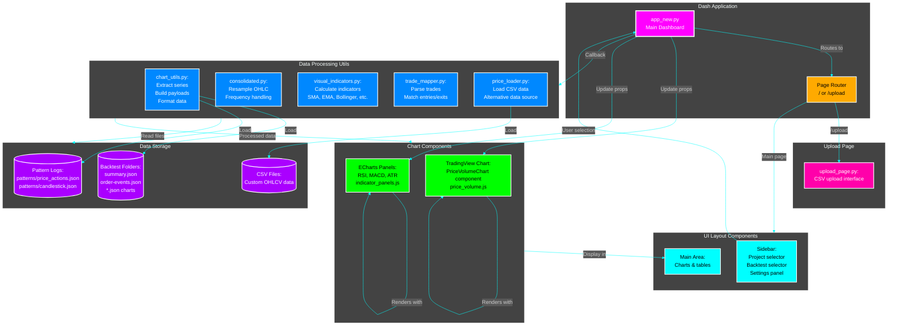
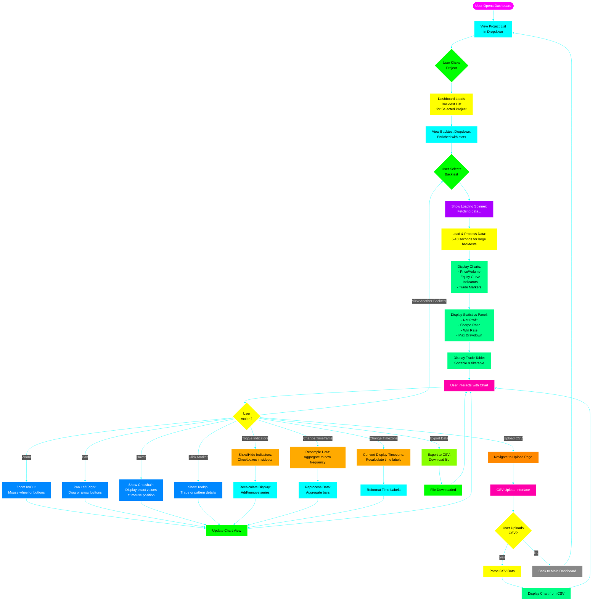
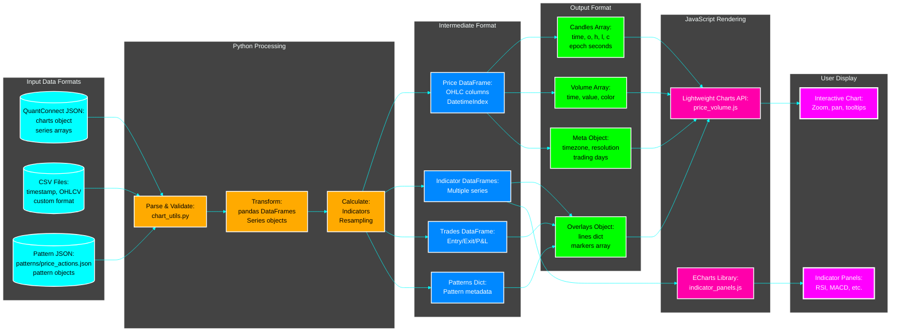

# ui System Flow

This document describes how the dashboard loads and displays backtest results and pattern overlays.

## Main Dashboard Architecture

```mermaid
%%{init: {'theme':'dark', 'themeVariables': { 'primaryColor':'#00ff00','primaryTextColor':'#fff','primaryBorderColor':'#00ff00','lineColor':'#00ffff','secondaryColor':'#ff00ff','tertiaryColor':'#ffff00','background':'#000000','mainBkg':'#1a1a1a','secondBkg':'#2d2d2d'}}}%%
flowchart TB
    Start([User Opens Dashboard]):::start --> InitDash[Initialize Dash App<br/>Load app_new.py]:::init
    
    InitDash --> ScanProjects[Scan Workspace:<br/>Find algo folders<br/>algo-main, algo-first, etc.]:::scan
    
    ScanProjects --> BuildProjectList[Build Project Dropdown:<br/>List of available algorithms]:::build
    
    BuildProjectList --> WaitSelect[Wait for User Selection]:::wait
    
    WaitSelect --> UserSelectProject[User Selects Project]:::user
    
    UserSelectProject --> ScanBacktests[Scan Project Backtests:<br/>List folders in backtests/]:::scan
    
    ScanBacktests --> EnrichLabels[Enrich Labels:<br/>- Read summary.json for P&L<br/>- Read order-events for symbol<br/>- Show date & stats]:::process
    
    EnrichLabels --> DisplayBacktests[Display Backtest Dropdown:<br/>Sorted by date newest first]:::display
    
    DisplayBacktests --> WaitBacktest[Wait for Backtest Selection]:::wait
    
    WaitBacktest --> UserSelectBacktest[User Selects Backtest]:::user
    
    UserSelectBacktest --> LoadBacktest[Load Backtest Data]:::load
    
    LoadBacktest --> End([Ready to Visualize]):::end
    
    classDef start fill:#ff00ff,stroke:#fff,stroke-width:3px,color:#fff
    classDef init fill:#00ffff,stroke:#fff,stroke-width:2px,color:#000
    classDef scan fill:#ffaa00,stroke:#fff,stroke-width:2px,color:#000
    classDef build fill:#00ff88,stroke:#fff,stroke-width:2px,color:#000
    classDef wait fill:#aa00ff,stroke:#fff,stroke-width:2px,color:#fff
    classDef user fill:#00ff00,stroke:#fff,stroke-width:2px,color:#000
    classDef process fill:#0088ff,stroke:#fff,stroke-width:2px,color:#fff
    classDef display fill:#ff00aa,stroke:#fff,stroke-width:2px,color:#fff
    classDef load fill:#ffff00,stroke:#fff,stroke-width:2px,color:#000
    classDef end fill:#ff00ff,stroke:#fff,stroke-width:3px,color:#fff
```

## Backtest Data Loading Flow

```mermaid
%%{init: {'theme':'dark', 'themeVariables': { 'primaryColor':'#00ff00','primaryTextColor':'#fff','primaryBorderColor':'#00ff00','lineColor':'#00ffff','secondaryColor':'#ff00ff','tertiaryColor':'#ffff00','background':'#000000','mainBkg':'#1a1a1a','secondBkg':'#2d2d2d'}}}%%
flowchart TB
    Start([Backtest Selected]):::event --> LoadJSON[Load All JSON Files:<br/>- summary.json<br/>- order-events.json<br/>- *.json performance files]:::load
    
    LoadJSON --> ParseSummary[Parse Summary:<br/>Extract statistics<br/>P&L, trades, sharpe, etc.]:::parse
    
    ParseSummary --> ParseCharts[Parse Charts Object:<br/>Contains all time series data]:::parse
    
    ParseCharts --> ExtractSeries[Extract Series:<br/>Convert to pandas Series<br/>- Price Open/High/Low/Close<br/>- Equity curve<br/>- Drawdown<br/>- Volume]:::extract
    
    ExtractSeries --> BuildPrice[Build Price DataFrame:<br/>Combine OHLC columns<br/>with datetime index]:::build
    
    BuildPrice --> ParseTrades[Parse Trade History:<br/>From order-events.json<br/>Entry/exit prices & times]:::parse
    
    ParseTrades --> CheckResample{User Selected<br/>Resampling?}:::decision
    
    CheckResample -->|No| OriginalData[Use Original Data:<br/>Native timeframe]:::use
    CheckResample -->|Yes| GetResampleParams[Get Resample Parameters:<br/>- Value e.g., 5<br/>- Unit e.g., minute<br/>- Timezone if specified]:::params
    
    GetResampleParams --> Resample[Resample OHLC Data:<br/>Aggregate bars to new timeframe<br/>- Open: first<br/>- High: max<br/>- Low: min<br/>- Close: last<br/>- Volume: sum]:::resample
    
    Resample --> AlignBars[Align Bars:<br/>Adjust to trading session times<br/>Handle DST transitions]:::align
    
    AlignBars --> PrepareData[Data Prepared]:::ready
    OriginalData --> PrepareData
    
    PrepareData --> CheckPatterns{Pattern Files<br/>Exist?}:::decision
    
    CheckPatterns -->|No| SkipPatterns[Skip Pattern Loading]:::skip
    CheckPatterns -->|Yes| LoadPatterns[Load Pattern Files:<br/>- patterns/price_actions.json<br/>- patterns/candlestick.json]:::load
    
    LoadPatterns --> ParsePatterns[Parse Pattern Data:<br/>Extract pattern details<br/>- Type & state<br/>- Prices & times<br/>- Quality scores]:::parse
    
    ParsePatterns --> PreparePatterns[Prepare Pattern Overlays:<br/>Convert to chart format]:::prepare
    
    PreparePatterns --> DataReady[All Data Ready]:::ready
    SkipPatterns --> DataReady
    
    DataReady --> BuildVisuals[Build Visualizations]:::build
    
    classDef event fill:#00aaff,stroke:#fff,stroke-width:2px,color:#fff
    classDef load fill:#ffff00,stroke:#fff,stroke-width:2px,color:#000
    classDef parse fill:#00ffff,stroke:#fff,stroke-width:2px,color:#000
    classDef extract fill:#00ff88,stroke:#fff,stroke-width:2px,color:#000
    classDef build fill:#00ff00,stroke:#fff,stroke-width:2px,color:#000
    classDef decision fill:#ffff00,stroke:#fff,stroke-width:2px,color:#000
    classDef use fill:#888888,stroke:#fff,stroke-width:2px,color:#fff
    classDef params fill:#ff00aa,stroke:#fff,stroke-width:2px,color:#fff
    classDef resample fill:#ffaa00,stroke:#fff,stroke-width:2px,color:#000
    classDef align fill:#0088ff,stroke:#fff,stroke-width:2px,color:#fff
    classDef ready fill:#00ff00,stroke:#fff,stroke-width:3px,color:#000
    classDef skip fill:#888888,stroke:#fff,stroke-width:2px,color:#fff
    classDef prepare fill:#ff8800,stroke:#fff,stroke-width:2px,color:#000
```



## Chart Rendering Flow

```mermaid
%%{init: {'theme':'dark', 'themeVariables': { 'primaryColor':'#00ff00','primaryTextColor':'#fff','primaryBorderColor':'#00ff00','lineColor':'#00ffff','secondaryColor':'#ff00ff','tertiaryColor':'#ffff00','background':'#000000','mainBkg':'#1a1a1a','secondBkg':'#2d2d2d'}}}%%
flowchart TB
    Start([Data Ready]):::start --> CalculateIndicators[Calculate Visual Indicators:<br/>If enabled in UI<br/>- SMA/EMA<br/>- Bollinger Bands<br/>- VWAP<br/>- Supertrend]:::calc
    
    CalculateIndicators --> PrepareCandles[Prepare Candle Data:<br/>Convert to lightweight-charts format:<br/>time: epoch seconds<br/>open, high, low, close]:::prepare
    
    PrepareCandles --> HandleTimezone{Timezone<br/>Specified?}:::decision
    
    HandleTimezone -->|No| UseUTC[Use UTC Timestamps:<br/>Standard epoch seconds]:::utc
    HandleTimezone -->|Yes| ConvertTimezone[Convert Timestamps:<br/>Preserve wall-clock time<br/>for specified timezone]:::convert
    
    ConvertTimezone --> BuildMeta[Build Metadata Object:<br/>- Timezone label<br/>- Timezone offset<br/>- Trading days list<br/>- Resolution info]:::meta
    UseUTC --> BuildMeta
    
    BuildMeta --> PrepareVolume[Prepare Volume Data:<br/>Color bars red/green<br/>based on price movement]:::prepare
    
    PrepareVolume --> PrepareOverlays[Prepare Overlay Data:<br/>- Indicator lines<br/>- Supertrend bands<br/>- Pattern necklines]:::prepare
    
    PrepareOverlays --> CheckTradeMarkers{Show Entry/Exit<br/>Markers?}:::decision
    
    CheckTradeMarkers -->|No| SkipMarkers[Skip Markers]:::skip
    CheckTradeMarkers -->|Yes| PrepareMarkers[Prepare Trade Markers:<br/>- Entry points green triangle up<br/>- Exit points red triangle down<br/>- Tooltips with details]:::markers
    
    PrepareMarkers --> CheckPatternOverlays{Pattern Overlays<br/>Enabled?}:::decision
    SkipMarkers --> CheckPatternOverlays
    
    CheckPatternOverlays -->|No| SkipPatternOverlays[Skip Pattern Overlays]:::skip
    CheckPatternOverlays -->|Yes| AddPatternMarkers[Add Pattern Markers:<br/>- Peak 1 marker<br/>- Peak 2 marker<br/>- Trough marker<br/>- Breakdown marker<br/>- Retest marker if exists]:::pattern
    
    AddPatternMarkers --> AddPatternLines[Add Pattern Lines:<br/>- Neckline horizontal line<br/>- Pattern boundary box<br/>- ATR bands if shown]:::pattern
    
    AddPatternLines --> AddPatternTooltips[Add Pattern Tooltips:<br/>- Pattern type & state<br/>- Quality score<br/>- Divergence info<br/>- Prices & times]:::pattern
    
    AddPatternTooltips --> ReadyToRender[All Overlays Ready]:::ready
    SkipPatternOverlays --> ReadyToRender
    
    ReadyToRender --> BuildPayload[Build Complete Payload:<br/>JSON object with:<br/>- candles array<br/>- volume array<br/>- overlays object<br/>- markers array<br/>- meta object]:::build
    
    BuildPayload --> SerializeJSON[Serialize to JSON:<br/>Convert Python objects<br/>Handle datetime conversion]:::serialize
    
    SerializeJSON --> UpdateAttributes[Update Component Attributes:<br/>data-candles<br/>data-volume<br/>data-overlays<br/>data-markers<br/>data-meta]:::update
    
    UpdateAttributes --> TriggerRender[Trigger Render Token:<br/>Change data-last-render<br/>to force chart update]:::trigger
    
    TriggerRender --> JSDetectsChange[JavaScript Observer<br/>Detects Attribute Change]:::js
    
    JSDetectsChange --> ParseAttributes[Parse JSON Attributes:<br/>Extract candles, overlays, etc.]:::js
    
    ParseAttributes --> CreateChart{Chart<br/>Exists?}:::decision
    
    CreateChart -->|No| InitializeChart[Initialize Lightweight Chart:<br/>Create chart instance<br/>Set dimensions & theme]:::js
    CreateChart -->|Yes| UpdateChart[Update Existing Chart]:::js
    
    InitializeChart --> AddCandleSeries[Add Candlestick Series:<br/>Configure colors & style]:::js
    AddCandleSeries --> AddVolumeSeries[Add Volume Histogram:<br/>Below price chart]:::js
    
    UpdateChart --> ClearOldData[Clear Old Series Data]:::js
    AddVolumeSeries --> SetData[Set New Data:<br/>candles & volume]:::js
    ClearOldData --> SetData
    
    SetData --> RenderOverlays[Render Overlay Lines:<br/>For each indicator:<br/>Create line series<br/>Set data & color]:::js
    
    RenderOverlays --> RenderMarkers[Render Markers:<br/>For each marker:<br/>Draw shape at position<br/>Attach tooltip]:::js
    
    RenderMarkers --> ApplyTimezone{Has Timezone<br/>Meta?}:::decision
    
    ApplyTimezone -->|Yes| SetFormatters[Set Time Formatters:<br/>Crosshair formatter<br/>Tick mark formatter<br/>Show timezone label]:::js
    ApplyTimezone -->|No| DefaultFormatters[Use Default UTC Formatters]:::js
    
    SetFormatters --> FitContent[Fit Visible Range:<br/>Auto-scale to data]:::js
    DefaultFormatters --> FitContent
    
    FitContent --> AddControls[Add Interactive Controls:<br/>Zoom +/-<br/>Scroll left/right<br/>Reset button]:::js
    
    AddControls --> ChartReady[Chart Displayed!<br/>User can interact]:::end
    
    classDef start fill:#ff00ff,stroke:#fff,stroke-width:3px,color:#fff
    classDef calc fill:#00ffff,stroke:#fff,stroke-width:2px,color:#000
    classDef prepare fill:#00ff88,stroke:#fff,stroke-width:2px,color:#000
    classDef decision fill:#ffff00,stroke:#fff,stroke-width:2px,color:#000
    classDef utc fill:#888888,stroke:#fff,stroke-width:2px,color:#fff
    classDef convert fill:#ffaa00,stroke:#fff,stroke-width:2px,color:#000
    classDef meta fill:#0088ff,stroke:#fff,stroke-width:2px,color:#fff
    classDef skip fill:#888888,stroke:#fff,stroke-width:2px,color:#fff
    classDef markers fill:#00ff00,stroke:#fff,stroke-width:2px,color:#000
    classDef pattern fill:#ff00aa,stroke:#fff,stroke-width:2px,color:#fff
    classDef ready fill:#00ff00,stroke:#fff,stroke-width:3px,color:#000
    classDef build fill:#00ff00,stroke:#fff,stroke-width:2px,color:#000
    classDef serialize fill:#00ffff,stroke:#fff,stroke-width:2px,color:#000
    classDef update fill:#ffaa00,stroke:#fff,stroke-width:2px,color:#000
    classDef trigger fill:#ff8800,stroke:#fff,stroke-width:2px,color:#000
    classDef js fill:#aa00ff,stroke:#fff,stroke-width:2px,color:#fff
    classDef end fill:#ff00ff,stroke:#fff,stroke-width:3px,color:#fff
```

## Pattern Overlay Detail Flow

```mermaid
%%{init: {'theme':'dark', 'themeVariables': { 'primaryColor':'#00ff00','primaryTextColor':'#fff','primaryBorderColor':'#00ff00','lineColor':'#00ffff','secondaryColor':'#ff00ff','tertiaryColor':'#ffff00','background':'#000000','mainBkg':'#1a1a1a','secondBkg':'#2d2d2d'}}}%%
flowchart TB
    Start([Pattern File Loaded]):::start --> CheckFile{File<br/>Exists?}:::decision
    
    CheckFile -->|No| NoPatterns[No Patterns:<br/>Return empty overlay]:::empty
    CheckFile -->|Yes| ReadJSON[Read JSON File:<br/>patterns/price_actions.json]:::read
    
    ReadJSON --> ParseEntries[Parse Pattern Entries:<br/>List of pattern objects]:::parse
    
    ParseEntries --> LoopPatterns[For Each Pattern Entry]:::loop
    
    LoopPatterns --> ExtractType[Extract Pattern Type:<br/>- Double Top<br/>- Double Bottom<br/>- Head & Shoulders]:::extract
    
    ExtractType --> ExtractState[Extract Pattern State:<br/>- Potential<br/>- Confirmed<br/>- Retested]:::extract
    
    ExtractState --> ExtractPrices[Extract Price Levels:<br/>- Peak 1 price & time<br/>- Peak 2 price & time<br/>- Trough price & time<br/>- Neckline price<br/>- Breakdown price & time if exists<br/>- Retest price & time if exists]:::extract
    
    ExtractPrices --> ExtractMeta[Extract Metadata:<br/>- Quality score<br/>- Volume divergence<br/>- RSI divergence<br/>- ATR ratios]:::extract
    
    ExtractMeta --> DetermineColor{Pattern<br/>State?}:::decision
    
    DetermineColor -->|Potential| ColorYellow[Use Yellow:<br/>Warning/watch state]:::color
    DetermineColor -->|Confirmed| ColorRed[Use Red:<br/>Danger/bearish signal]:::color
    DetermineColor -->|Retested| ColorOrange[Use Orange:<br/>Validated pattern]:::color
    
    ColorYellow --> CreatePeak1Marker[Create Peak 1 Marker:<br/>Circle at peak 1<br/>Label: P1<br/>Time & price position]:::marker
    ColorRed --> CreatePeak1Marker
    ColorOrange --> CreatePeak1Marker
    
    CreatePeak1Marker --> CreatePeak2Marker[Create Peak 2 Marker:<br/>Circle at peak 2<br/>Label: P2<br/>Time & price position]:::marker
    
    CreatePeak2Marker --> CreateTroughMarker[Create Trough Marker:<br/>Triangle at trough<br/>Label: T<br/>Time & price position]:::marker
    
    CreateTroughMarker --> CreateNeckline[Create Neckline Line:<br/>Horizontal dashed line<br/>At trough price<br/>From peak 1 to beyond peak 2]:::line
    
    CreateNeckline --> CheckBreakdown{Breakdown<br/>Occurred?}:::decision
    
    CheckBreakdown -->|Yes| CreateBreakdownMarker[Create Breakdown Marker:<br/>Red arrow pointing down<br/>At breakdown time & price<br/>Label: BREAK]:::marker
    CheckBreakdown -->|No| SkipBreakdown[Skip breakdown marker]:::skip
    
    CreateBreakdownMarker --> CheckRetest{Retest<br/>Occurred?}:::decision
    SkipBreakdown --> CheckRetest
    
    CheckRetest -->|Yes| CreateRetestMarker[Create Retest Marker:<br/>Yellow triangle<br/>At retest time & price<br/>Label: RETEST]:::marker
    CheckRetest -->|No| SkipRetest[Skip retest marker]:::skip
    
    CreateRetestMarker --> BuildTooltip[Build Rich Tooltip HTML:<br/>Pattern Type: Double Top<br/>State: Confirmed<br/>Peak 1: $100.50 @ 10:30<br/>Peak 2: $100.30 @ 11:45<br/>Neckline: $98.00<br/>Quality: 0.85<br/>Volume Div: Yes<br/>RSI Div: No]:::tooltip
    SkipRetest --> BuildTooltip
    
    BuildTooltip --> AddToOverlay[Add to Overlay Payload:<br/>markers array<br/>lines object]:::add
    
    AddToOverlay --> MorePatterns{More<br/>Patterns?}:::decision
    
    MorePatterns -->|Yes| LoopPatterns
    MorePatterns -->|No| ReturnOverlay[Return Complete<br/>Overlay Payload]:::return
    
    NoPatterns --> End([Pattern Processing Done]):::end
    ReturnOverlay --> End
    
    classDef start fill:#ff00ff,stroke:#fff,stroke-width:3px,color:#fff
    classDef decision fill:#ffff00,stroke:#fff,stroke-width:2px,color:#000
    classDef empty fill:#888888,stroke:#fff,stroke-width:2px,color:#fff
    classDef read fill:#00ffff,stroke:#fff,stroke-width:2px,color:#000
    classDef parse fill:#00ff88,stroke:#fff,stroke-width:2px,color:#000
    classDef loop fill:#aa00ff,stroke:#fff,stroke-width:2px,color:#fff
    classDef extract fill:#0088ff,stroke:#fff,stroke-width:2px,color:#fff
    classDef color fill:#ff00aa,stroke:#fff,stroke-width:2px,color:#fff
    classDef marker fill:#00ff00,stroke:#fff,stroke-width:2px,color:#000
    classDef line fill:#ffaa00,stroke:#fff,stroke-width:2px,color:#000
    classDef skip fill:#888888,stroke:#fff,stroke-width:2px,color:#fff
    classDef tooltip fill:#ff8800,stroke:#fff,stroke-width:2px,color:#000
    classDef add fill:#00ff00,stroke:#fff,stroke-width:2px,color:#000
    classDef return fill:#00ff00,stroke:#fff,stroke-width:3px,color:#000
    classDef end fill:#ff00ff,stroke:#fff,stroke-width:3px,color:#fff
```

## Component Architecture



## User Interaction Flow



## File Organization

```mermaid
%%{init: {'theme':'dark', 'themeVariables': { 'primaryColor':'#00ff00','primaryTextColor':'#fff','primaryBorderColor':'#00ff00','lineColor':'#00ffff','secondaryColor':'#ff00ff','tertiaryColor':'#ffff00','background':'#000000','mainBkg':'#1a1a1a','secondBkg':'#2d2d2d'}}}%%
graph TB
    Root[ui/]:::root
    
    Root --> AppNew[app_new.py<br/>Main dashboard<br/>TradingView charts]:::main
    Root --> App[app.py<br/>Legacy dashboard<br/>Plotly charts]:::legacy
    
    Root --> AssetsDir[assets/]:::dir
    AssetsDir --> TVAssets[tradingview/<br/>price_volume.js<br/>Chart renderer]:::js
    AssetsDir --> EChartsAssets[echarts/<br/>indicator_panels.js<br/>Indicator panels]:::js
    
    Root --> UtilsDir[utils/]:::dir
    UtilsDir --> ChartUtils[chart_utils.py<br/>Data transformation]:::util
    UtilsDir --> Consolidated[consolidated.py<br/>Resampling logic]:::util
    UtilsDir --> VisualInd[visual_indicators.py<br/>Indicator calculation]:::util
    UtilsDir --> TradeMap[trade_mapper.py<br/>Trade parsing]:::util
    UtilsDir --> PriceLoad[price_loader.py<br/>CSV loading]:::util
    UtilsDir --> Conversion[conversion.py<br/>Format conversion]:::util
    UtilsDir --> FSHelpers[fs_helpers.py<br/>File system utils]:::util
    
    Root --> TVDir[tradingview/]:::dir
    TVDir --> TVInit[__init__.py<br/>PriceVolumeChart<br/>Dash component]:::component
    
    Root --> EChartsDir[echarts/]:::dir
    EChartsDir --> EChartsInit[__init__.py<br/>EChartsPanel<br/>Dash component]:::component
    
    Root --> PagesDir[pages/]:::dir
    PagesDir --> UploadPage[upload_page.py<br/>CSV upload interface]:::page
    
    Root --> DocsDir[docs/]:::dir
    DocsDir --> README[README_APPPY.md<br/>Documentation]:::doc
    DocsDir --> CSVFormat[CSV_FORMAT_README.md<br/>CSV spec]:::doc
    
    Root --> Requirements[requirements.txt<br/>Python dependencies]:::config
    Root --> TODOFile[TODO.md<br/>Task list]:::doc
    
    classDef root fill:#ff00ff,stroke:#fff,stroke-width:3px,color:#fff
    classDef main fill:#00ff00,stroke:#fff,stroke-width:2px,color:#000
    classDef legacy fill:#888888,stroke:#fff,stroke-width:2px,color:#fff
    classDef dir fill:#00ffff,stroke:#fff,stroke-width:2px,color:#000
    classDef js fill:#ffaa00,stroke:#fff,stroke-width:2px,color:#000
    classDef util fill:#0088ff,stroke:#fff,stroke-width:2px,color:#fff
    classDef component fill:#00ff88,stroke:#fff,stroke-width:2px,color:#000
    classDef page fill:#ff00aa,stroke:#fff,stroke-width:2px,color:#fff
    classDef doc fill:#aa00ff,stroke:#fff,stroke-width:2px,color:#fff
    classDef config fill:#ffff00,stroke:#fff,stroke-width:2px,color:#000
```



## Data Format Flow



## Glossary

- **Dash**: Python web framework for building interactive dashboards
- **Lightweight Charts**: JavaScript library for financial charts (by TradingView)
- **ECharts**: Apache charting library for data visualization
- **OHLC**: Open, High, Low, Close price data
- **Epoch Seconds**: Unix timestamp (seconds since 1970-01-01)
- **Resampling**: Aggregating bars to a different timeframe (e.g., 1min → 5min)
- **Overlay**: Visual element drawn on top of chart (lines, markers, shapes)
- **Crosshair**: Interactive vertical line following mouse cursor
- **Tooltip**: Pop-up box showing details when hovering over chart elements
- **UTC**: Coordinated Universal Time, standard timezone reference
- **Wall-Time**: Local clock time in a specific timezone
- **Trading Days**: List of dates that had trading activity (excludes weekends/holidays)
